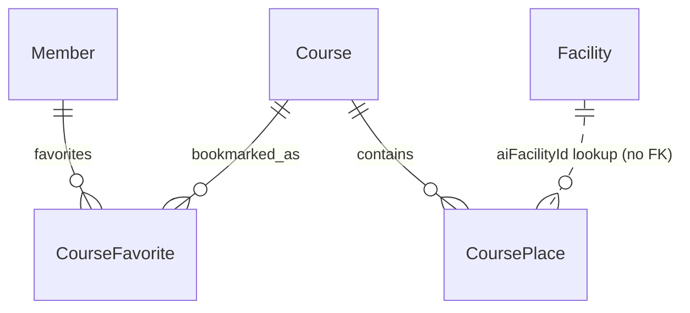

# 시설·코스·즐겨찾기 엔티티

강지윤의 5주차(2026-09-29~10-05) 시설·코스·즐겨찾기 설계를 JPA 엔티티로 구체화한다. 기존 회원·로그인 코드에 시설과 코스 데이터 모델을 추가한 범위다. API와 AI 동기화 서비스는 후속 작업이다.

## 패키지와 공통 필드

| 클래스 | 패키지 | 역할 |
|---|---|---|
| `Facility` | `domain.facility.entity` | 사용자 API가 보관하는 시설 원본 |
| `Course` | `domain.course.entity` | 저장된 코스와 관심분야·태그 |
| `CoursePlace` | `domain.course.entity` | 코스 생성 당시의 방문 장소 정보 |
| `CourseFavorite` | `domain.course.entity` | 회원과 코스의 즐겨찾기 관계 |
| `CourseRecommendationFailureLog` | `domain.course.entity` | 추천 실패 유형과 원인 메시지 |
| `CourseRecommendationFailureType` | `domain.course` | 추천 실패 유형 열거형 |

새 엔티티는 `global.entity.BaseEntity`를 상속한다. `id`는 JPA가 생성하는 UUID이고, `createdAt`과 `updatedAt`은 Spring Data JPA Auditing이 기록한다. `JpaAuditingConfig`는 기존 `ClockConfig`의 `Asia/Seoul` Clock을 사용한다. `createdAt`은 최초 저장 시 기록하고 갱신하지 않는다.

엔티티 생성은 `@Builder`로 통일한다. 필드 변경은 Setter로 하고 입력 검증·동기화·추천 판단은 후속 Service에 둔다. 기존 `Member`의 ID 생성과 로그인 동작은 그대로 사용한다.

## Facility

| 필드 | Java 타입 | 저장 규칙·용도 |
|---|---|---|
| `aiFacilityId` | `Long` | AI 서버 시설 ID. 동기화·역조회 키이며 값이 있으면 유일해야 한다 |
| `code` | `String` | 원천 시설 코드 |
| `sourceCategory` | `String` | 수집 자료의 분류 |
| `name` | `String` | 시설 이름. NOT NULL |
| `intro`, `description` | `String` | 소개와 상세 설명. PostgreSQL text |
| `latitude`, `longitude` | `Double` | 위도·경도. 좌표 없는 원천 자료도 보관할 수 있도록 nullable |
| `facilityType` | `String` | 시설 유형. 수집 측 유형 어휘가 확정되기 전까지 문자열로 보관 |
| `lastSeenAt` | `LocalDateTime` | AI 수집 자료에서 마지막으로 확인한 시각 |
| `openTime`, `closeTime` | `LocalTime` | 개장·폐장 시간. 일정하지 않거나 정보가 없으면 nullable |
| `operatingNote` | `String` | 요일·계절 등 운영 안내. PostgreSQL text |

`Facility.id`는 사용자 API의 UUID이고 `aiFacilityId`는 AI 서버의 숫자 ID다. 두 식별자는 서로 바꿔 쓸 수 없다. `uk_facility_ai_id`는 동일한 AI 항목이 두 번 저장되는 것을 막는다. AI 원본이 없는 수동 등록 시설은 `aiFacilityId`가 null일 수 있다.

`lastSeenAt`은 엔티티가 수정된 시각인 `updatedAt`과 다르다. 관리자가 설명을 수정했다고 AI 자료에서 다시 확인된 것은 아니다. 동기화 시각 갱신과 사라진 시설의 처리 정책은 후속 동기화 Service가 담당하며, 원천에서 사라졌다는 이유만으로 즉시 삭제하지 않는다.

## Course와 CoursePlace

| 엔티티 | 필드 | Java 타입·저장 방식 |
|---|---|---|
| `Course` | `title` | `String`, NOT NULL |
| `Course` | `interestTypes` | `List<String>`, `course_interest_type` 컬렉션 테이블 |
| `Course` | `tagLabels` | `List<String>`, `course_tag_label` 컬렉션 테이블 |
| `Course` | `estimatedDurationMinutes` | `Integer`, 분 단위, NOT NULL |
| `Course` | `entrance`, `exit` | `String`, 입구·출구 식별값, NOT NULL |
| `Course` | `places` | `List<CoursePlace>`, `visitOrder` 오름차순, LAZY |
| `CoursePlace` | `course` | `Course`, LAZY, NOT NULL인 `course_id` 외래키 |
| `CoursePlace` | `visitOrder` | `Integer`, NOT NULL. 서비스에서 1부터 부여 |
| `CoursePlace` | `facilityId` | `Long`, AI 서버 시설 ID 값. NOT NULL이며 시설 외래키는 없음 |
| `CoursePlace` | `name`, `category` | `String`, 생성 당시의 이름·분류, NOT NULL |
| `CoursePlace` | `latitude`, `longitude` | `Double`, 생성 당시의 위도·경도, NOT NULL |
| `CoursePlace` | `mapX` | `Double`, 선택적인 도식형 지도 좌표 |

관심분야와 태그는 `@ElementCollection`으로 저장하고 `@OrderColumn`으로 목록 순서를 보존한다. 코스와 장소는 `@OneToMany(mappedBy = "course", cascade = ALL)`로 연결한다. 코스를 저장하면 연결된 장소도 저장하고 코스를 삭제하면 연결된 장소도 삭제한다. `(course_id, visit_order)` 유일 제약으로 코스 안의 방문 순서 중복을 막는다.

양방향 관계의 저장 책임은 `CoursePlace.course`에 있다. 후속 Service는 `course.getPlaces()`에 장소를 넣는 것과 함께 `place.setCourse(course)`도 수행해야 한다. 목록에서 장소를 빼는 것만으로 삭제되지 않는다. 장소 삭제·순서 변경 정책은 Service 구현 단계에서 정한다.

### 장소는 스냅샷으로 보관한다

`CoursePlace.facilityId`는 `Facility.aiFacilityId`를 찾기 위한 조회 키다. `Facility.id`와 연결되는 JPA 연관관계가 아니다. 이름·분류·좌표를 장소 행에 복사하므로 시설 정보가 변경되거나 시설이 삭제되어도 저장 코스의 표시 정보는 유지된다.

외래키로 시설을 직접 참조하면 시설 삭제와 과거 코스 보존 요구가 충돌한다. 참조와 캐시를 함께 두면 캐시 갱신 시점을 별도로 정의해야 한다. 즐겨찾기한 코스는 당시의 기록이라는 요구에 따라 스냅샷 방식으로 정했다. 따라서 시설 이름이 변경돼도 과거 코스에는 이전 이름이 남는다.

좌표 없는 `Facility`는 보관할 수 있지만 좌표 없는 `CoursePlace`는 저장할 수 없다. 실제 시설 존재 여부, 중복 방문지, 입출구 혼입, 이름·좌표, 양수 소요시간 등은 추천 Service에서 확인해야 한다. NOT NULL이나 유일 제약만으로 추천 결과의 유효성이 보장되지는 않는다.

## CourseFavorite

`member`는 기존 `domain.member.Member`, `course`는 `Course`에 각각 `@ManyToOne(LAZY)`으로 연결한다. 두 외래키는 NOT NULL이다. `uk_course_favorite_member_course`는 같은 회원이 같은 코스를 중복 저장하는 것을 막는다.

즐겨찾기에서 회원이나 코스로 cascade를 전파하지 않는다. 즐겨찾기를 지워도 회원과 코스는 삭제되지 않는다. 반대로 즐겨찾기가 남은 회원·코스를 삭제하려면 후속 Service에서 해당 관계를 먼저 정리해야 한다. 정렬에 필요한 생성 시각과 예상 소요시간은 각각 `CourseFavorite.createdAt`과 `Course.estimatedDurationMinutes`를 사용한다.

## CourseRecommendationFailureLog

`failureType`은 `CourseRecommendationFailureType`을 STRING으로 저장하고 `message`는 PostgreSQL text로 저장한다. 두 필드는 NOT NULL이다. 생성 시각은 공통 `createdAt`으로 확인한다.

| 초기 실패 유형 | 용도 |
|---|---|
| `AI_COMMUNICATION_FAILURE` | AI 서버 호출 실패 |
| `EMPTY_RESPONSE` | 추천 응답이 비어 있음 |
| `NULL_COURSE_ITEM` | 응답 목록에 null 코스가 있음 |
| `MISSING_REQUIRED_FIELD` | 추천 코스의 필수 정보가 없음 |
| `MISSING_FACILITY_INFO` | 장소를 표시할 시설 정보가 부족함 |
| `NO_VISITABLE_COURSE` | 검증 후 방문 가능한 코스가 없음 |

검증 흐름에서 사용할 초기 분류를 정의한 것이며, 이번 변경이 실패를 자동으로 수집하는 것은 아니다. 실제 분류 조건과 기록 시점은 추천 Service에서 구현한다. 메시지에는 인증 토큰·서비스 계정 키·개인정보를 포함하지 않는다.

## 데이터 흐름과 관계

공식·공공 자료 → AI 수집·정제 → 사용자 API 동기화·검증 → 앱 조회, 관리자 검수 순서다. 시설·도감은 다른 데이터의 참조와 추천 검증 기준이 필요해 사용자 API DB로 복제한다. 날씨·혼잡도는 요청 시 AI 서버에서 중계하며 이번에 엔티티나 저장소를 추가하지 않는다.



점선은 조회 키의 대응을 설명하며 DB 외래키를 뜻하지 않는다. 추천 실패 기록은 시설·코스 삭제와 무관하게 보관할 수 있도록 별도 엔티티다.

## 적용과 확인

현재 프로젝트의 `spring.jpa.hibernate.ddl-auto: update`에 따라 다음 실행에서 시설·코스·장소·즐겨찾기·실패 기록 및 컬렉션 테이블이 생성된다. 기존 로그인 요청·응답과 `Member` 테이블 매핑은 변경하지 않는다. 이번 범위에는 Flyway 도입이나 운영 DB 마이그레이션이 포함되지 않는다.

```powershell
.\gradlew.bat compileJava build
```

DB 실행 확인 시에는 새 테이블의 UUID 식별자, 회원·코스 외래키, 방문 순서·즐겨찾기·AI 시설 ID의 유일 제약을 확인한다. 엔티티 저장 시 생성·수정 시각이 채워지는지, 시설 정보 변경 후 저장 코스의 이름·좌표가 유지되는지도 확인한다.

후속 구현 범위는 Repository·Service·Controller, AI 동기화, 추천 결과 검증과 실패 기록, 즐겨찾기 등록·삭제·조회, 관리자 인증과 화면이다.

참고: [5주차 설계](week5-design.md), [협업 규칙](collaboration.md), [Jakarta Persistence ElementCollection](https://jakarta.ee/specifications/persistence/3.2/apidocs/jakarta.persistence/jakarta/persistence/elementcollection), [Spring Data JPA Auditing](https://docs.spring.io/spring-data/jpa/reference/auditing.html).
