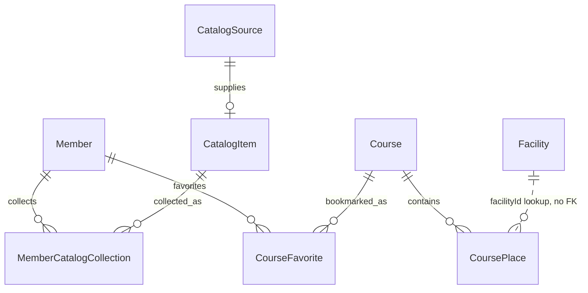

# 5주차 설계 정리

근거: 김재현·강지윤 5주차 학습보고서(2026-09-29~10-05). 아래는 보고서의 설계 결정을 재구성한 문서이며, 이 저장소에 있는 실행 코드 범위는 로그인 1차뿐이다.

## 회원과 로그인

- `Member.id`는 UUID. `email`은 Apple 비공개 이메일 대응으로 nullable.
- `nickname`은 NOT NULL. `socialType + providerId`와 `nickname`에 각각 DB 유일 제약(`uk_member_social_provider`, `uk_member_nickname`)을 둔다. 동시 요청에서는 조회 후 삽입만으로 유일성을 보장할 수 없다.
- 기기 정보는 `deviceType`, `deviceId`, 선택적인 `fcmToken`; 동의 정보는 개인정보·위치정보·이용약관·마케팅 네 종류. 필수 약관은 앞의 세 개다.
- 로그인 요청은 Firebase ID Token과 소셜 유형(`GOOGLE` 또는 `APPLE`), 기기 정보를 받는다. 서버가 토큰과 제공자 일치를 검증하고, 회원 조회 또는 생성 후 자체 액세스 토큰을 반환한다. `firstLogin`과 `requiresAgreement`로 앱이 온보딩 화면을 결정한다.
- 닉네임 자동 생성 정책과 유일 제약 충돌 재시도, 갱신 토큰 재발급·로그아웃은 다음 주 구현 범위다. 이 저장소의 임시 닉네임 방식은 시연을 위한 현재 시점의 구현 선택이다.

## 도감

| 층 | 역할 | 핵심 관계·규칙 |
|---|---|---|
| `CatalogSource` | 크롤링 원본 | 재수집 시 갱신; `lastSeenAt` 기록 |
| `CatalogItem` | 앱에 보이는 항목 | 이름·이미지·특징·좌표 등의 override가 있으면 원본보다 우선; 어린이용 설명·순서·상태는 자체 필드 |
| `MemberCatalogCollection` | 회원별 수집 | 회원·항목·수집 시각; `(member_id, catalog_item_id)` 유일 제약으로 중복 수집 방지 |

`CatalogItem` 상태는 `AVAILABLE`, `SUSPENDED`, `RETIRED`. 크롤링에서 사라져도 수집 이력을 유지하려고 삭제 대신 은퇴 상태를 사용한다. 시설에서 유래한 장소 항목도 이 구조에 맞춰 연결한다. 이 설계의 API와 엔티티는 이 발표용 저장소에 구현하지 않았다.

## 시설과 코스

- `Facility`: AI 데이터의 식별자 `aiFacilityId`, 코드·원천 분류·이름·설명·좌표·시설 유형·운영시간·`lastSeenAt`. AI 수집 자료를 사용자 API로 동기화할 때 `aiFacilityId`로 매칭한다.
- `Course`: 제목, 관심분야 목록, 태그, 예상 소요시간, 입구·출구. `CoursePlace`는 방문 순서와 `facilityId`, 당시의 이름·분류·좌표·지도 좌표를 저장한다.
- `CoursePlace.facilityId`는 조회 키이며 외래키가 아니다. 과거 코스가 이후 시설 변경·삭제에 따라 달라지지 않도록 시점 정보를 복사한다.
- `CourseFavorite`는 회원과 코스를 연결한다. 추천 실패 기록은 `failureType`과 `message`로 원인을 분류한다.
- 흐름: 공식·공공 자료 → AI 수집·정제 → 사용자 API 동기화·검증 → 앱 조회, 관리자 검수. 추천 결과도 사용자 API가 실제 시설과 좌표를 검증한 뒤 저장한다.

위 그림은 관계 설명용이다. 3주차 공동 ERD 초안의 12개 테이블을 그대로 복제한 완성 스키마가 아니다.
